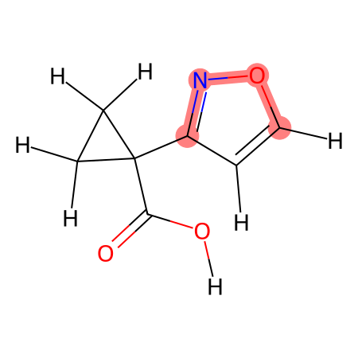

# known-issues
known issues with openff force fields

# Usage
For a torsion in Sage 2.1.0, in this case t129, simply run

``` shell
make TARGET=t129
```

This will compute the coverage based on `datasets/td-set-for-fitting.json` and
the Sage 2.1.0 force field built in to `openff-toolkit`. You can optionally
specify a different force field and multiple datasets using the `FF` and `DATA`
variables. Fully specifying the defaults would look like this:

``` shell
make TARGET=t129 FF=openff-2.1.0.offxml DATA=datasets/td-set-for-fitting.json
```

These both generate the file `output/report.pdf`, which contains images of the
molecules covered by the target in the data set with the specific torsions
highlighted. The figures are captioned by the corresponding SMILES string.



